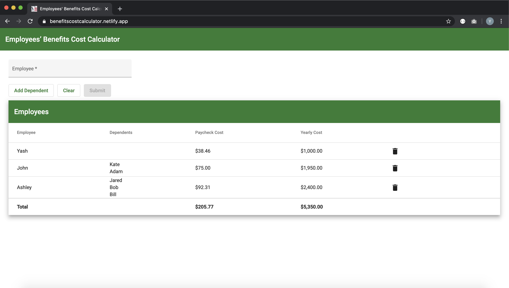

# Employee Benefits Calculator

MEAN Stack Web Application to calculate employee cost benefits and store calculations for employees in MongoDB.

M: MongoDB

E: Express.js

A: Angular 9 

N: Node.js

## Usage
* Run `npm install`
* Run `npm install -g @angular/cli`
* Run `ng serve` and navigate to `localhost:4200`
* Run `nodemon server.js`
